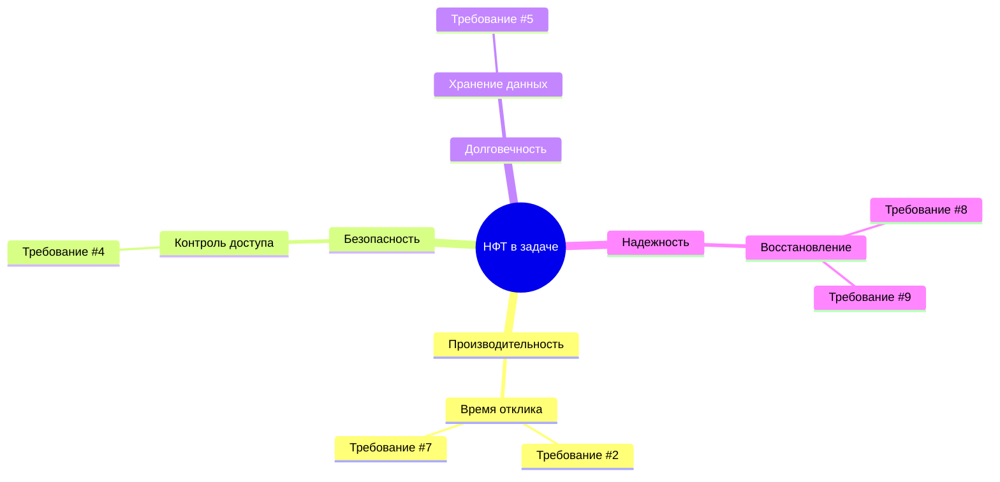

# 🎯 Exercise 00 — Определение нефункциональных требований

<!--
Student: @https://edu.21-school.ru/profile/lunchlpr
Location: SKD SAMARKAND  
GitHub: https://github.com/wh0mever

-->

## 📝 Задание

**Выпишите номера предложений, содержащих нефункциональные требования.**

## 🔍 Анализ требований

### 📊 Визуальная схема анализа

```
🎯 АНАЛИЗ ТРЕБОВАНИЙ 1-9
═══════════════════════════════════════════════════════════════

┌─────────────────────────────────────────────────────────────┐
│  ФУНКЦИОНАЛЬНЫЕ vs НЕФУНКЦИОНАЛЬНЫЕ ТРЕБОВАНИЯ              │
└─────────────────────────────────────────────────────────────┘

Требование 1: "Формировать список слотов"
    ┌─────────┐    ✓ ФУНКЦИОНАЛЬНОЕ
    │ Что?    │ ──→ Формирование списка  
    └─────────┘

Требование 2: "Формировать список слотов не более чем за 10 сек"
    ┌─────────┐    ✗ НЕФУНКЦИОНАЛЬНОЕ  
    │ Как?    │ ──→ Время выполнения + нагрузка
    │ Сколько?│    (Производительность)
    └─────────┘

Требование 3: "Доступ по ролям"
    ┌─────────┐    ✓ ФУНКЦИОНАЛЬНОЕ
    │ Что?    │ ──→ Контроль доступа
    └─────────┘

Требование 4: "Доступ только сотрудникам управления"  
    ┌─────────┐    ✗ НЕФУНКЦИОНАЛЬНОЕ
    │ Кто?    │ ──→ Ограничения безопасности
    └─────────┘    (Безопасность)

Требование 5: "Сохранять информацию не менее 3 лет"
    ┌─────────┐    ✗ НЕФУНКЦИОНАЛЬНОЕ
    │ Сколько?│ ──→ Время хранения
    └─────────┘    (Долговечность)

Требование 6: "Рассчитывать оплату курьеру"
    ┌─────────┐    ✓ ФУНКЦИОНАЛЬНОЕ  
    │ Что?    │ ──→ Расчет оплаты
    └─────────┘

Требование 7: "Рассчитывать остатки не позднее 50 минут"
    ┌─────────┐    ✗ НЕФУНКЦИОНАЛЬНОЕ
    │ Когда?  │ ──→ Время выполнения + объем данных
    │ Сколько?│    (Производительность)
    └─────────┘

Требование 8: "Восстановление не более чем за 30 минут"
    ┌─────────┐    ✗ НЕФУНКЦИОНАЛЬНОЕ
    │ Как     │ ──→ Время восстановления
    │ быстро? │    (Надежность)
    └─────────┘

Требование 9: "Восстанавливать данные, потеря не более 5 минут"
    ┌─────────┐    ✗ НЕФУНКЦИОНАЛЬНОЕ
    │ Сколько │ ──→ Допустимая потеря данных  
    │ потерь? │    (Надежность)
    └─────────┘
```

### 📈 Статистика анализа

```
РЕЗУЛЬТАТ АНАЛИЗА
═════════════════
                    
 Функциональные     Нефункциональные
     (33%)              (67%)
  ┌─────────┐        ┌─────────────┐
  │    3    │        │      6      │
  │ ■ ■ ■   │        │ ■ ■ ■ ■ ■ ■ │  
  └─────────┘        └─────────────┘
  
 Требования:         Требования:
 1, 3, 6            2, 4, 5, 7, 8, 9

ТИПЫ НФТ В АНАЛИЗЕ:
• Производительность: 2, 7
• Безопасность: 4  
• Долговечность: 5
• Надежность: 8, 9
```

### 🧠 D2 схема мышления (альтернативная визуализация)

```d2
# Современная схема анализа требований
analysis: Анализ требований {
  shape: hexagon
  style.fill: "#E3F2FD"
}

functional: Функциональные {
  shape: circle
  style.fill: "#C8E6C9"
  
  req1: "1. Список слотов"
  req3: "3. Доступ по ролям" 
  req6: "6. Расчет оплаты"
}

nonfunctional: Нефункциональные {
  shape: circle  
  style.fill: "#FFCDD2"
  
  performance: Производительность {
    req2: "2. ≤10 сек, 1000 юзеров"
    req7: "7. ≤50 мин, 1М счетов"
  }
  
  security: Безопасность {
    req4: "4. Только сотрудники"
  }
  
  durability: Долговечность {
    req5: "5. ≥3 года хранения"
  }
  
  reliability: Надежность {
    req8: "8. Восстановление ≤30 мин"
    req9: "9. Потери ≤5 мин"
  }
}

analysis -> functional
analysis -> nonfunctional
```

## 🎯 Ответ

**Нефункциональные требования:**

```
2, 4, 5, 7, 8, 9
```

## 💡 Классификация по характеристикам



## 🏆 Ключевые выводы

### 📈 Статистика анализа:
- **Всего требований:** 9
- **Нефункциональных:** 6 (67%)
- **Функциональных:** 3 (33%)

### 🎨 Основные паттерны НФТ:

1. **Количественные метрики** - конкретные числа (10 сек, 1000 пользователей, 3 года)
2. **Ограничения производительности** - время выполнения при определенной нагрузке
3. **Требования безопасности** - кто имеет доступ к данным
4. **Параметры надежности** - время восстановления и потеря данных

### 🚀 Практическое применение:

Этот анализ показывает, что **67% требований** в реальных проектах могут быть нефункциональными, что подчеркивает их критическую важность для успеха системы.

---

**📋 Оценка:** Шкала от 1 до 5 ⭐⭐⭐⭐⭐

**🔄 Следующий шаг:** [Exercise 01 - Классификация НФТ](exercise_01.md) 
