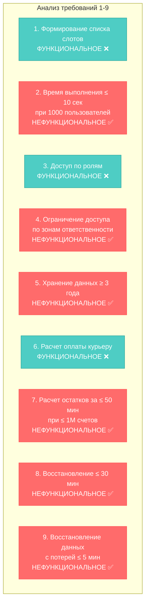
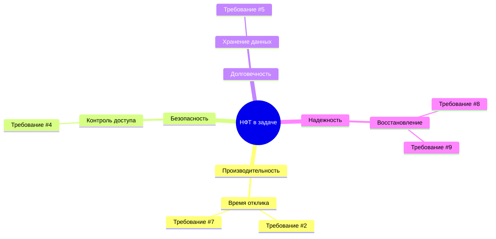

# 🎯 Exercise 00 — Определение нефункциональных требований

<!--
Student: @https://edu.21-school.ru/profile/lunchlpr
Location: SKD SAMARKAND  
GitHub: https://github.com/wh0mever

-->

## 📝 Задание

**Выпишите номера предложений, содержащих нефункциональные требования.**

## 🔍 Анализ требований



## 📊 Результат анализа

### ✅ Нефункциональные требования (НФТ):

| № | Требование | Тип НФТ | Обоснование |
|---|------------|---------|-------------|
| **2** | Время формирования списка ≤ 10 сек при 1000 пользователей | **Производительность** | Указывает КАК быстро система должна выполнять функцию |
| **4** | Доступ только сотрудникам управления и контролерам | **Безопасность** | Определяет КТО может получить доступ к данным |
| **5** | Хранение информации о заказах ≥ 3 года | **Долговечность** | Устанавливает КАК ДОЛГО хранить данные |
| **7** | Расчет остатков ≤ 50 мин при ≤ 1М счетов | **Производительность** | Время выполнения в условиях нагрузки |
| **8** | Восстановление системы ≤ 30 минут | **Надежность** | Время восстановления после сбоя |
| **9** | Потеря данных ≤ 5 минут при сбое | **Надежность** | Допустимая потеря данных (RPO) |

### ❌ Функциональные требования:

| № | Требование | Почему функциональное |
|---|------------|----------------------|
| **1** | Формирование списка свободных слотов | Описывает ЧТО должна делать система |
| **3** | Предоставление доступа по ролям | Описывает функцию системы |
| **6** | Расчет оплаты курьеру | Описывает бизнес-логику |

## 🎯 Ответ

**Номера предложений с нефункциональными требованиями:**

```
2, 4, 5, 7, 8, 9
```

## 💡 Классификация по характеристикам



## 🏆 Ключевые выводы

### 📈 Статистика анализа:
- **Всего требований:** 9
- **Нефункциональных:** 6 (67%)
- **Функциональных:** 3 (33%)

### 🎨 Основные паттерны НФТ:

1. **Количественные метрики** - конкретные числа (10 сек, 1000 пользователей, 3 года)
2. **Ограничения производительности** - время выполнения при определенной нагрузке
3. **Требования безопасности** - кто имеет доступ к данным
4. **Параметры надежности** - время восстановления и потеря данных

### 🚀 Практическое применение:

Этот анализ показывает, что **67% требований** в реальных проектах могут быть нефункциональными, что подчеркивает их критическую важность для успеха системы.

---

**📋 Оценка:** Шкала от 1 до 5 ⭐⭐⭐⭐⭐

**🔄 Следующий шаг:** [Exercise 01 - Классификация НФТ](exercise_01.md) 