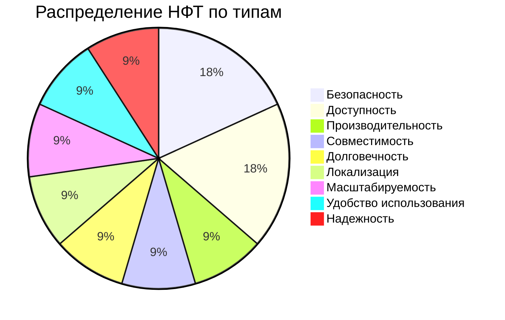
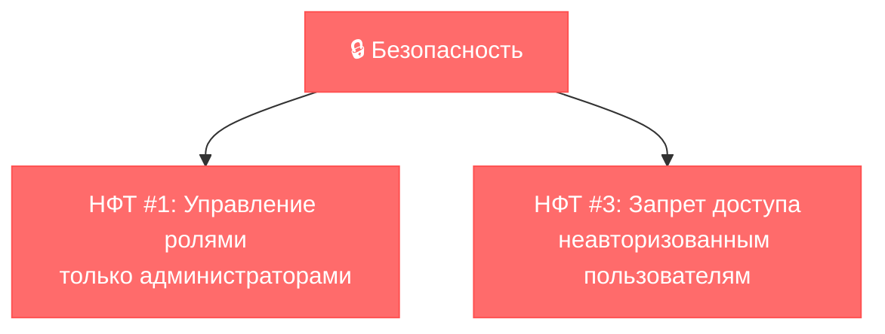
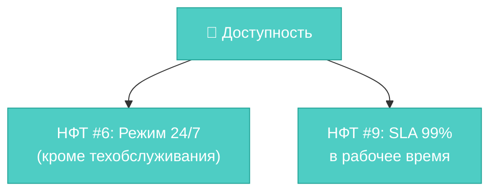
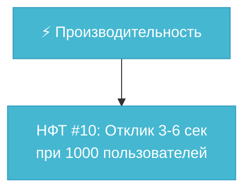
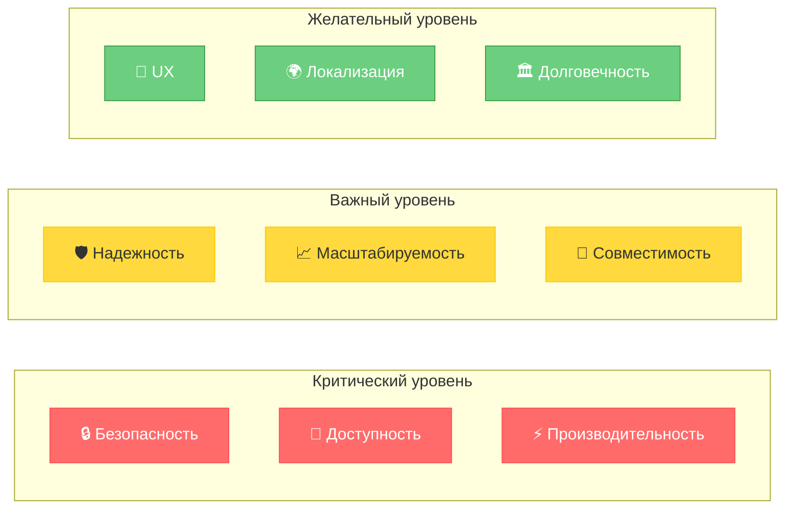

# 🏷️ Exercise 01 — Классификация нефункциональных требований

<!--
Student: @https://edu.21-school.ru/profile/lunchlpr
Location: SKD SAMARKAND  
GitHub: https://github.com/wh0mever

-->

## 📝 Задание

**Сопоставить нефункциональные требования с типами НФТ и разместить результаты в таблицу.**

### 🎯 Типы НФТ для классификации:

```mermaid
graph LR
    subgraph "9 типов НФТ"
        A["1. Доступность"] 
        B["2. Надежность"]
        C["3. Масштабируемость"]
        D["4. Локализация"]
        E["5. Удобство использования"]
        F["6. Производительность"]
        G["7. Совместимость"]
        H["8. Долговечность"]
        I["9. Безопасность"]
    end
    
    classDef type1 fill:#ff6b6b,stroke:#ff5252,color:#fff
    classDef type2 fill:#4ecdc4,stroke:#26a69a,color:#fff
    classDef type3 fill:#45b7d1,stroke:#339bc2,color:#fff
    
    class A,B,C type1
    class D,E,F type2  
    class G,H,I type3
```

## 📊 Результат классификации

| № НФТ | Требование | Тип НФТ | Обоснование |
|-------|------------|---------|-------------|
| **1** | Доступ для администратора к управлению ролями | **🔒 Безопасность** | Контроль доступа к критическим функциям |
| **2** | Хранение данных об оплатах ≥ 5 лет | **🏛️ Долговечность** | Срок сохранения данных |
| **3** | Запрет доступа всем кроме администраторов | **🔒 Безопасность** | Ограничение прав доступа |
| **4** | Восстановление системы ≤ 30 минут | **🛡️ Надежность** | Время восстановления после сбоя |
| **5** | Отображение регионального времени | **🌍 Локализация** | Адаптация под региональные особенности |
| **6** | Доступность 24/7 кроме воскресенья 2-4 | **📡 Доступность** | Режим работы системы |
| **7** | Поэтапное внедрение по регионам | **📈 Масштабируемость** | План расширения системы |
| **8** | Современные UX-интерфейсы с настройками | **🎨 Удобство использования** | Пользовательский опыт |
| **9** | Доступность 99% в рабочее время | **📡 Доступность** | SLA по времени работы |
| **10** | Время отклика ≤ 3-6 сек при 1000 пользователей | **⚡ Производительность** | Время отклика под нагрузкой |
| **11** | Поддержка Chrome, Safari, Firefox | **🔗 Совместимость** | Кроссбраузерная совместимость |

## 🎨 Визуализация распределения типов



## 🔍 Подробный анализ по категориям

### 🔒 Безопасность (2 требования)


### 📡 Доступность (2 требования)  


### ⚡ Производительность (1 требование)


## 🎯 Ключевые паттерны классификации

### 🚀 По критичности для бизнеса:



## 📈 Статистика и выводы

### 📊 Количественный анализ:

| Категория | Количество | Процент | Приоритет |
|-----------|------------|---------|-----------|
| 🔒 **Безопасность** | 2 | 18% | 🔴 Критический |
| 📡 **Доступность** | 2 | 18% | 🔴 Критический |
| ⚡ **Производительность** | 1 | 9% | 🔴 Критический |
| 🛡️ **Надежность** | 1 | 9% | 🟡 Важный |
| 📈 **Масштабируемость** | 1 | 9% | 🟡 Важный |
| 🔗 **Совместимость** | 1 | 9% | 🟡 Важный |
| 🎨 **Удобство использования** | 1 | 9% | 🟢 Желательный |
| 🌍 **Локализация** | 1 | 9% | 🟢 Желательный |
| 🏛️ **Долговечность** | 1 | 9% | 🟢 Желательный |

### 🎯 Ключевые инсайты:

1. **Безопасность + Доступность** = 36% всех требований → основа любой системы
2. **Критические НФТ** (54%) преобладают над остальными
3. **Равномерное распределение** остальных типов указывает на комплексный подход

## 🏆 Практическая ценность

### ✅ Что дает эта классификация:

- **Приоритизация разработки** - начинаем с критических НФТ
- **Распределение ресурсов** - больше времени на безопасность и доступность
- **Архитектурные решения** - выбор технологий под типы НФТ
- **Тестирование** - планирование тестов по категориям

### 🚀 Применение в проектах:

Данная классификация позволяет **структурированно подходить** к анализу НФТ и обеспечивает полное покрытие всех аспектов качества системы.

---

**📋 Оценка:** Шкала от 1 до 5 ⭐⭐⭐⭐⭐

**🔄 Следующий шаг:** [Exercise 02 - Выбор НФТ](exercise_02.md) 