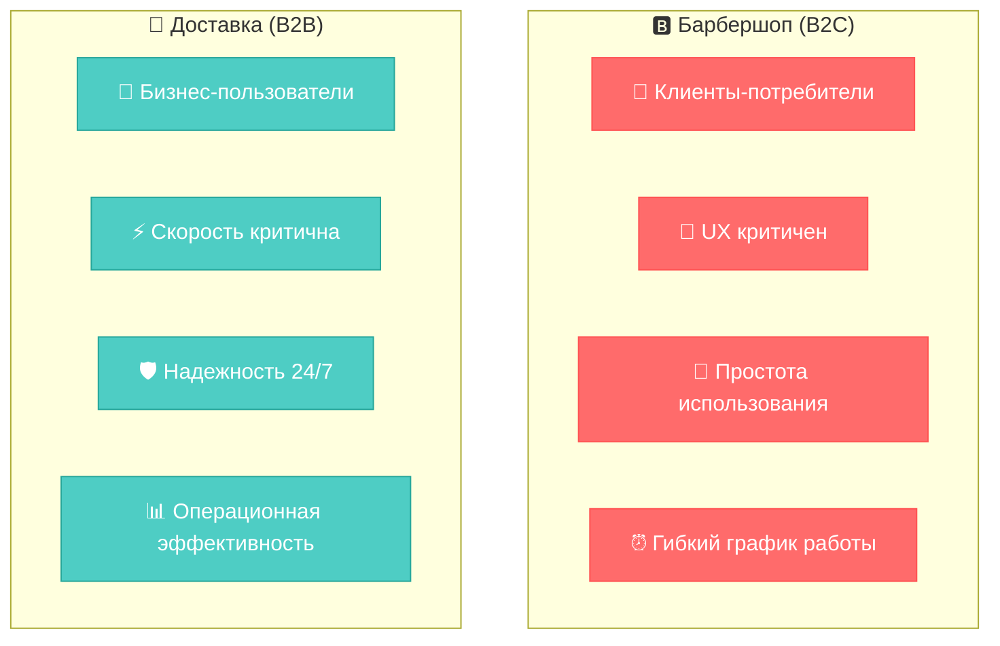
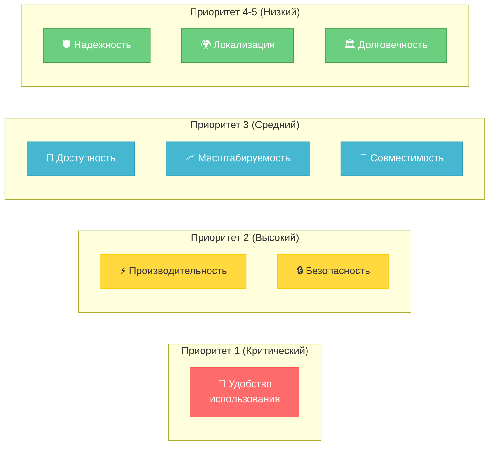
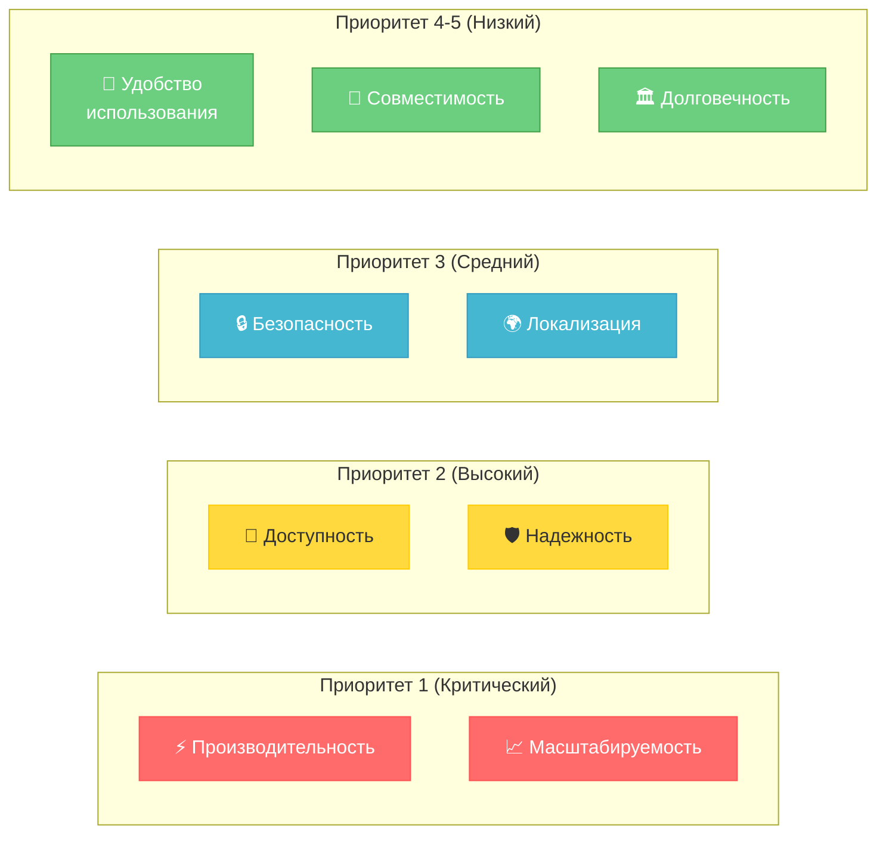
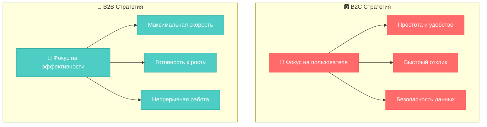
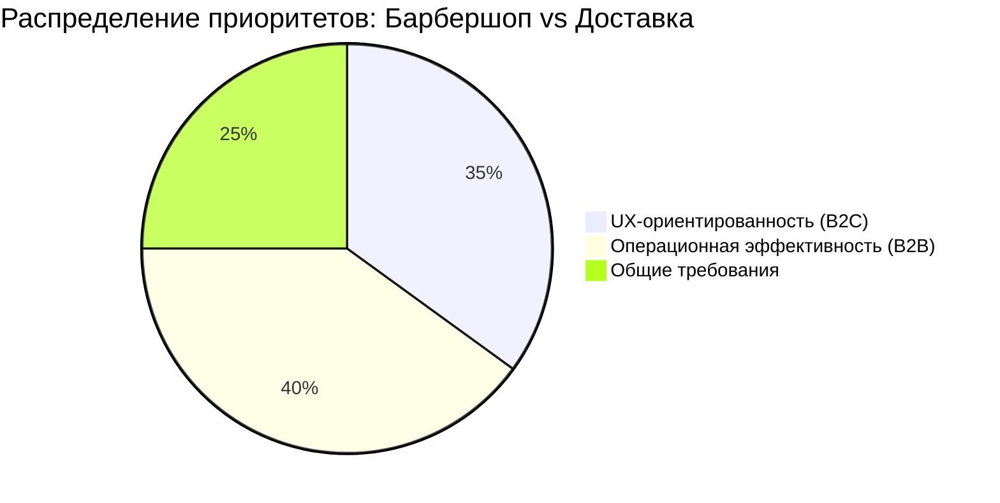

# 🎯 Exercise 02 — Выбор НФТ

<!--
Student: @https://edu.21-school.ru/profile/lunchlpr
Location: SKD SAMARKAND  
GitHub: https://github.com/wh0mever

-->

## 📝 Задание

**Выберите типы НФТ для каждой задачи и укажите приоритеты от 1 до 5 (1 — высший приоритет).**

## 🏗️ Сравнение систем

## 📊 Матрица приоритетов НФТ

| Тип НФТ | 🅱️ Барбершоп | 🚚 Доставка | Обоснование различий |
|---------|---------------|-------------|---------------------|
| **🎨 Удобство использования** | **1** | **4** | B2C: клиенты могут уйти к конкурентам B2B: обучение пользователей возможно |
| **⚡ Производительность** | **2** | **1** | B2C: важно, но не критично B2B: каждая секунда = деньги |
| **📡 Доступность** | **3** | **2** | B2C: работа в определенные часы OK B2B: простои = убытки |
| **🛡️ Надежность** | **4** | **2** | B2C: можно перенести запись B2B: потеря заказа недопустима |
| **🔒 Безопасность** | **2** | **3** | B2C: персональные данные B2B: коммерческая информация |
| **📈 Масштабируемость** | **3** | **1** | B2C: постепенный рост B2B: быстрое масштабирование |
| **🔗 Совместимость** | **3** | **4** | B2C: разные устройства клиентов B2B: корпоративные стандарты |
| **🏛️ Долговечность** | **5** | **5** | Оба: архивные данные менее критичны |
| **🌍 Локализация** | **4** | **3** | B2C: важно для UX B2B: операционная необходимость |

## 🎨 Визуализация приоритетов

### 🅱️ Барбершоп - B2C приоритеты

### 🚚 Доставка - B2B приоритеты

## 🔍 Сравнительный анализ стратегий

## 📈 Детальный анализ приоритетов

### 🔥 Критические различия (Приоритет 1-2):

#### 🅱️ Барбершоп:
- **🎨 UX (Приоритет 1)**: Клиенты выбирают удобный сервис
- **⚡ Производительность (Приоритет 2)**: Быстрая запись = довольный клиент
- **🔒 Безопасность (Приоритет 2)**: Доверие к персональным данным

#### 🚚 Доставка:
- **⚡ Производительность (Приоритет 1)**: Время = деньги в логистике
- **📈 Масштабируемость (Приоритет 1)**: Быстрый рост бизнеса
- **📡 Доступность (Приоритет 2)**: 24/7 работа критична

### 🎯 Стратегические выводы:

## 🏆 Обоснование выбора

### 🅱️ Барбершоп (B2C логика):

1. **Клиентоориентированность** - пользователи могут легко уйти к конкурентам
2. **Эмоциональный фактор** - удобство важнее технических характеристик
3. **Толерантность к простоям** - можно перенести запись на другое время
4. **Гибкость требований** - не все функции критичны одновременно

### 🚚 Доставка (B2B логика):

1. **Операционная критичность** - каждая минута простоя = убытки
2. **Масштабируемость бизнеса** - готовность к быстрому росту
3. **Профессиональные пользователи** - могут адаптироваться к интерфейсу
4. **Интеграционные требования** - связь с другими системами

## 🎨 Матрица воздействия на бизнес

| НФТ | Барбершоп: Влияние на бизнес | Доставка: Влияние на бизнес |
|-----|----------------------------|----------------------------|
| **🎨 UX** | 🔴 **Критично** - отток клиентов | 🟡 Важно - эффективность работы |
| **⚡ Производительность** | 🟡 Важно - удовлетворенность | 🔴 **Критично** - операционные потери |
| **📡 Доступность** | 🟢 Умеренно - гибкий график | 🔴 **Критично** - упущенные заказы |
| **🛡️ Надежность** | 🟢 Умеренно - можно перенести | 🔴 **Критично** - потеря заказов |

## 🚀 Практическое применение

### ✅ Как использовать эти приоритеты:

1. **Планирование разработки** - начинать с приоритета 1
2. **Распределение бюджета** - больше ресурсов на критические НФТ
3. **Архитектурные решения** - выбор технологий под приоритеты
4. **Тестирование** - фокус на приоритетных характеристиках
5. **Метрики успеха** - KPI по приоритетным НФТ

### 🎯 Ключевой инсайт:

**Один размер не подходит всем!** B2C и B2B системы требуют кардинально разных подходов к приоритизации НФТ.

---

**📋 Оценка:** Шкала от 1 до 5 ⭐⭐⭐⭐⭐

**🔄 Следующий шаг:** [Exercise 03 - Атрибуты производительности](exercise_03.md) 