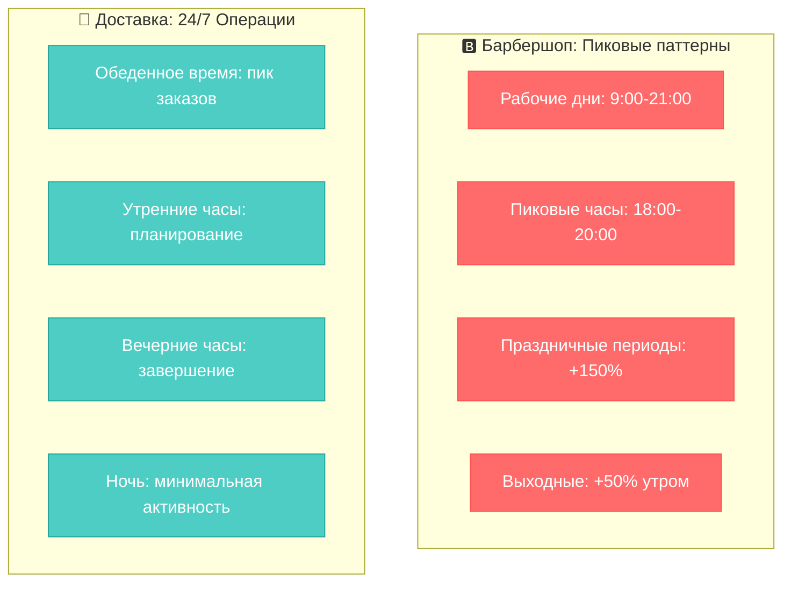
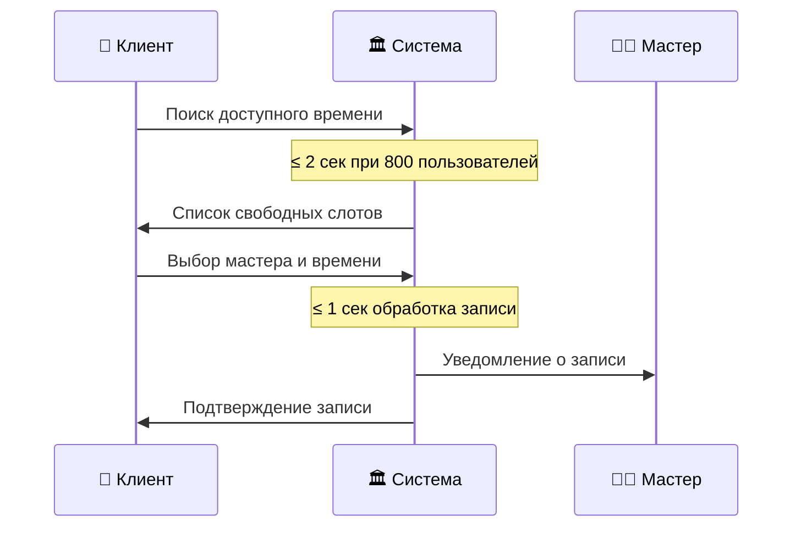
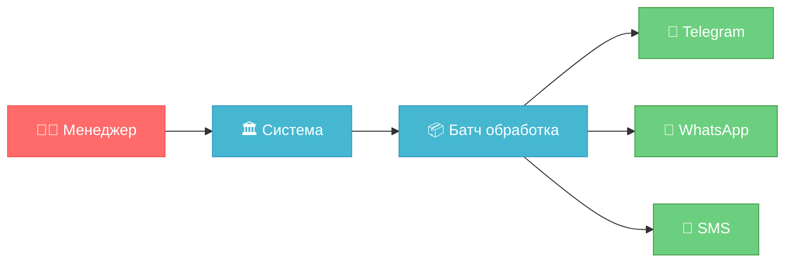
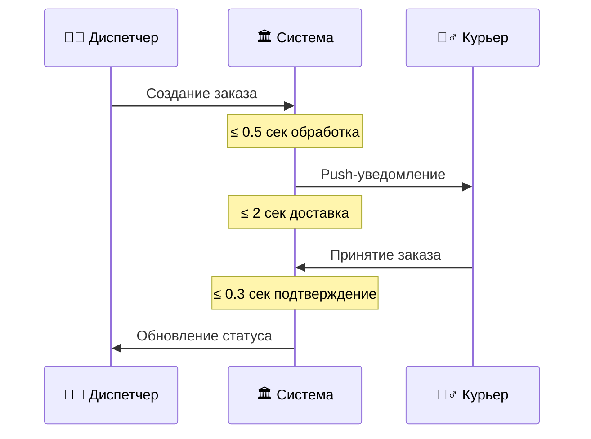
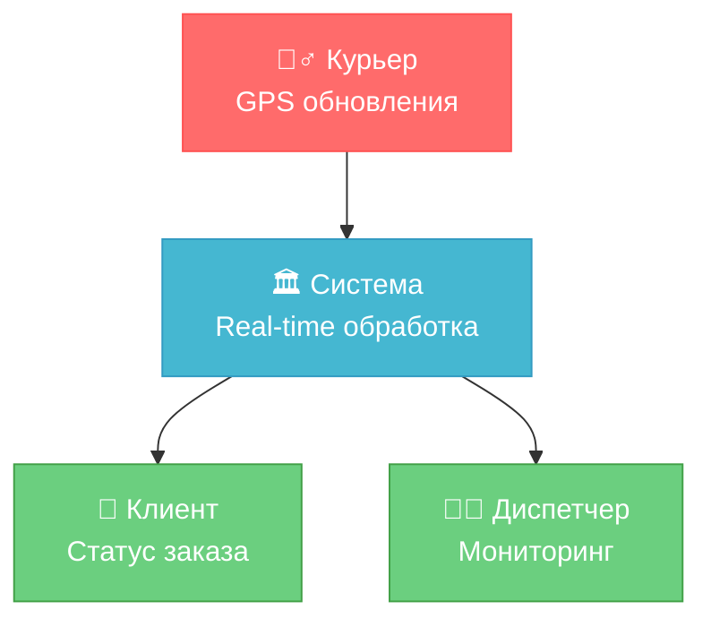
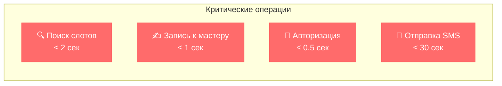
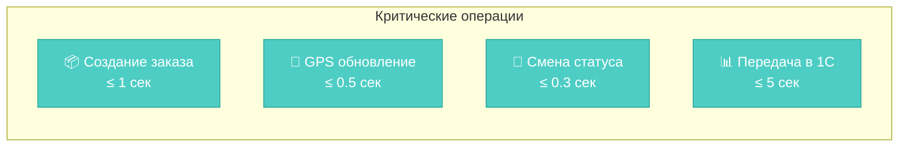
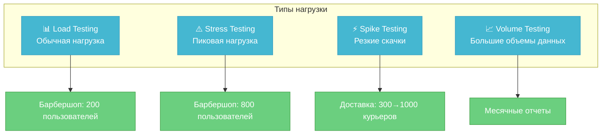

# ⚡ Exercise 03 — Атрибуты производительности

<!--
Student: @https://edu.21-school.ru/profile/lunchlpr
Location: SKD SAMARKAND  
GitHub: https://github.com/wh0mever

-->

## 📝 Задание

**Указать атрибуты производительности для обеих задач с детальными метриками и сценариями использования.**

## 🏗️ Архитектура нагрузки систем

## 📊 Сценарии и метрики производительности

### 🅱️ Барбершоп - Сценарии B2C

#### 📈 Сценарий 1: Поиск и запись к мастеру
**Роли:** Клиент, Система

| Метрика | Обычная нагрузка | Пиковая нагрузка | SLA |
|---------|------------------|------------------|-----|
| **Одновременные пользователи** | 200 | 800 | - |
| **Время поиска слотов** | ≤ 1 сек | ≤ 2 сек | 95% |
| **Время записи** | ≤ 0.5 сек | ≤ 1 сек | 99% |
| **Пропускная способность** | 500 записей/час | 2000 записей/час | - |

#### 📈 Сценарий 2: Массовая отправка уведомлений
**Роли:** Система, Менеджер, Клиенты

| Метрика | Значение | Обоснование |
|---------|----------|-------------|
| **Обработка уведомлений** | 1000 уведомлений за 5 минут | Напоминания на следующий день |
| **Время отправки** | ≤ 30 сек на пакет 100 уведомлений | Batch-обработка |
| **Успешность доставки** | ≥ 95% | Критично для клиентского сервиса |

#### 📈 Сценарий 3: Формирование отчетов
**Роли:** Менеджер, Система
| Операция | Время выполнения | Объем данных |
|----------|------------------|--------------|
| **Дневной отчет** | ≤ 10 сек | До 500 записей |
| **Недельный отчет** | ≤ 30 сек | До 3500 записей |
| **Месячный отчет** | ≤ 2 мин | До 15000 записей |

### 🚚 Доставка - Сценарии B2B

#### 📈 Сценарий 1: Распределение заказов курьерам
**Роли:** Диспетчер, Курьер, Система

| Метрика | Обычная нагрузка | Пиковая нагрузка | SLA |
|---------|------------------|------------------|-----|
| **Активные курьеры** | 150 | 300 | - |
| **Создание заказа** | ≤ 0.5 сек | ≤ 1 сек | 99% |
| **Уведомление курьеров** | ≤ 2 сек | ≤ 3 сек | 95% |
| **Обновление статуса** | ≤ 0.3 сек | ≤ 0.5 сек | 99.5% |

#### 📈 Сценарий 2: Трекинг заказов в реальном времени
**Роли:** Курьер, Система, Клиент

| Метрика | Значение | Критичность |
|---------|----------|-------------|
| **GPS обновления** | Каждые 30 сек | 🔴 Критично |
| **Обработка координат** | ≤ 0.2 сек | 🔴 Критично |
| **Обновление статуса** | Real-time (≤ 1 сек) | 🔴 Критично |
| **Пропускная способность** | 300 курьеров × 120 обновлений/час | - |

#### 📈 Сценарий 3: Интеграция с бухгалтерией
**Роли:** Система, Бухгалтерская система
| Операция | Частота | Время обработки | Объем |
|----------|---------|-----------------|-------|
| **Передача данных о заказах** | Каждые 15 мин | ≤ 5 сек | До 200 заказов |
| **Расчет оплаты курьерам** | Ежедневно в 23:00 | ≤ 10 мин | До 1500 заказов |
| **Финансовые отчеты** | По запросу | ≤ 30 сек | Любой период |

## 📊 Сводная таблица SLA

### 🅱️ Барбершоп
| Операция | Среднее время | Максимальное время | Доступность |
|----------|---------------|-------------------|-------------|
| **Поиск слотов** | 1 сек | 2 сек | 99% |
| **Запись к мастеру** | 0.5 сек | 1 сек | 99.5% |
| **Отправка уведомлений** | 30 сек/100 шт | 60 сек/100 шт | 95% |
| **Генерация отчетов** | 10 сек | 2 мин | 99% |

### 🚚 Доставка
| Операция | Среднее время | Максимальное время | Доступность |
|----------|---------------|-------------------|-------------|
| **Создание заказа** | 0.5 сек | 1 сек | 99.5% |
| **Уведомление курьеров** | 2 сек | 3 сек | 99% |
| **GPS трекинг** | 0.2 сек | 0.5 сек | 99.9% |
| **Интеграция с 1С** | 5 сек | 10 сек | 99% |

## 🎯 Критические операции

### 🔥 Барбершоп - TOP критичных операций:

### 🔥 Доставка - TOP критичных операций:

## 📈 Планы нагрузочного тестирования

### 🎯 Стратегия тестирования:

## 🏆 Ключевые инсайты

### ✅ Различия в подходах:

1. **Барбершоп (B2C)**: Фокус на **удобстве пользователя** — времена отклика до 2 секунд
2. **Доставка (B2B)**: Фокус на **операционной эффективности** — времена отклика до 0.5 секунд

### 🎯 Критические факторы успеха:

- **Барбершоп**: Простота записи + быстрые уведомления
- **Доставка**: Мгновенные обновления + надежная интеграция

### 📊 Метрики мониторинга:

| Система | Ключевые KPI | Алерты |
|---------|--------------|--------|
| **Барбершоп** | Время записи, конверсия записей | > 2 сек |
| **Доставка** | Время создания заказа, GPS задержки | > 1 сек |

---

**📋 Оценка:** Шкала от 1 до 5 ⭐⭐⭐⭐⭐

**🔄 Следующий шаг:** [Exercise 04 - Доступность и надежность](exercise_04.md) 