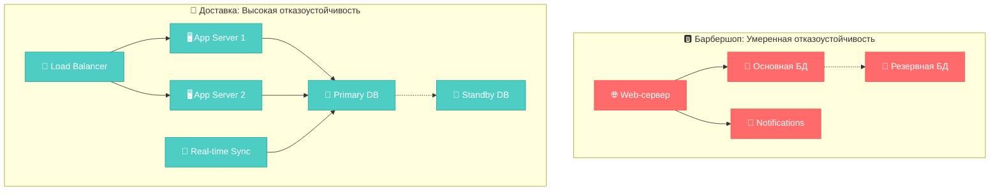
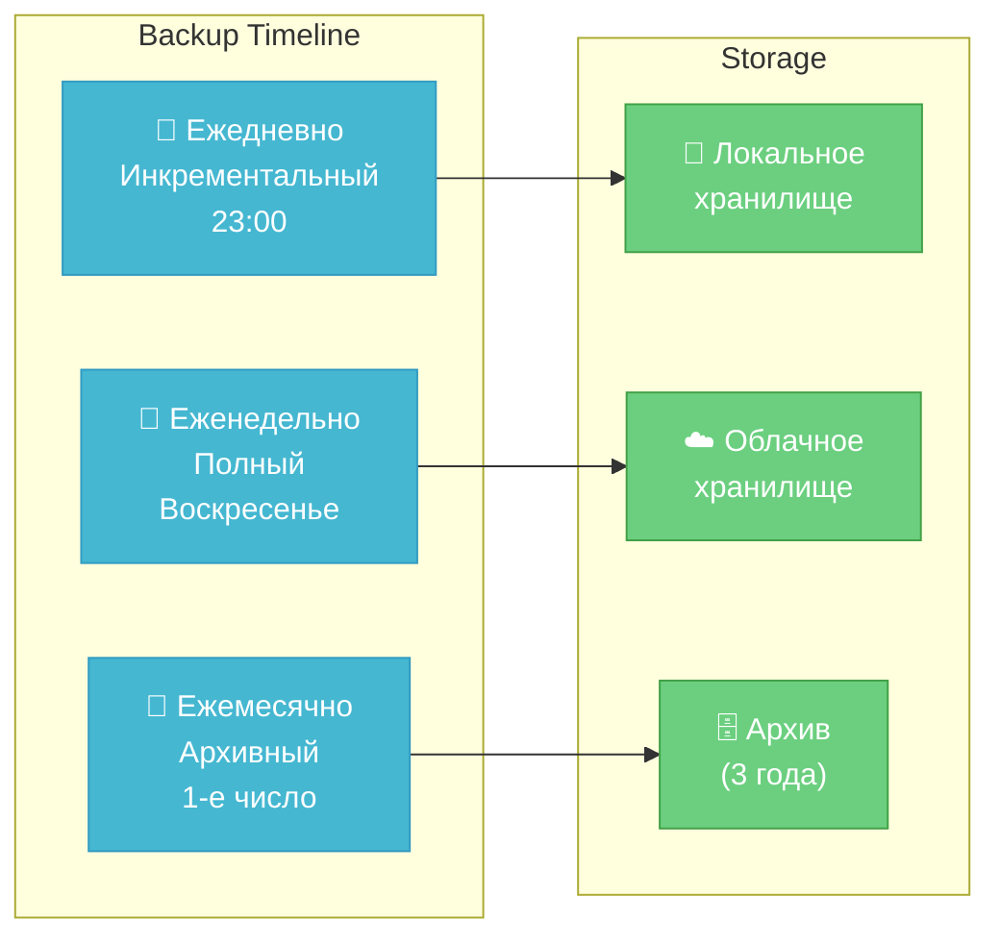
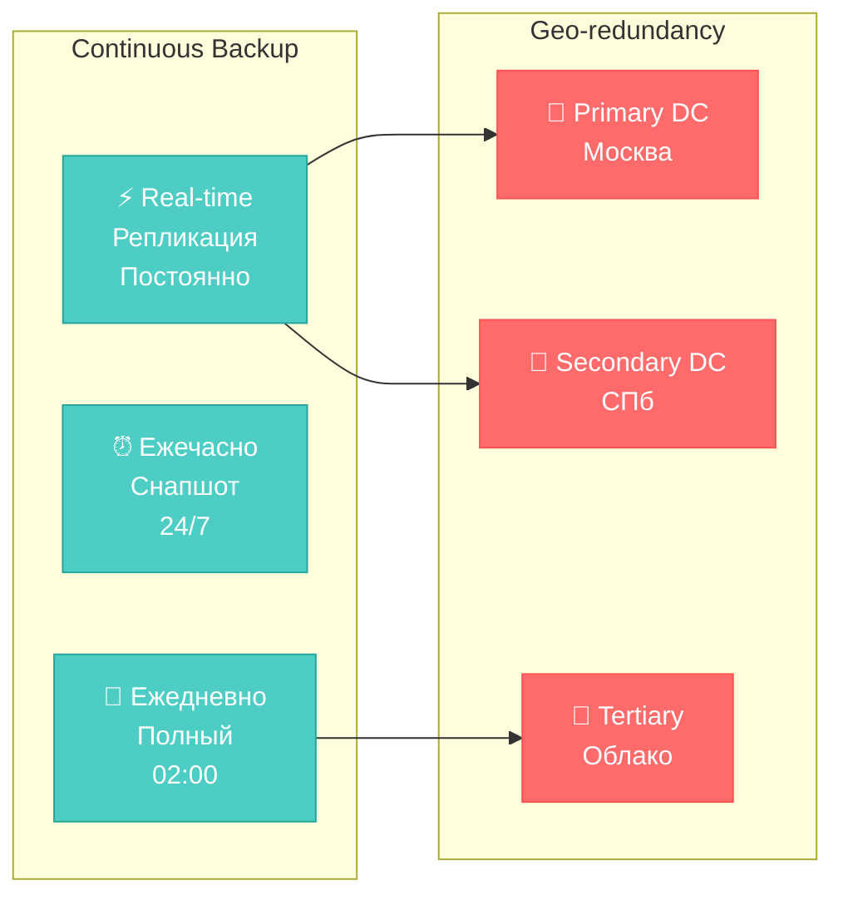
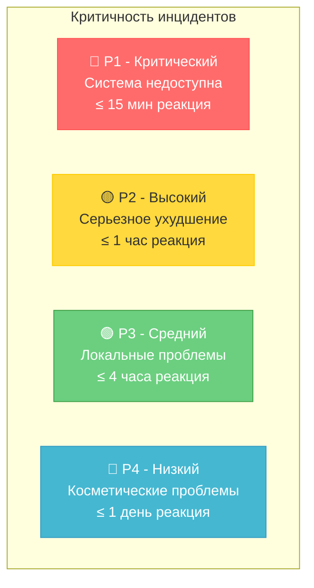
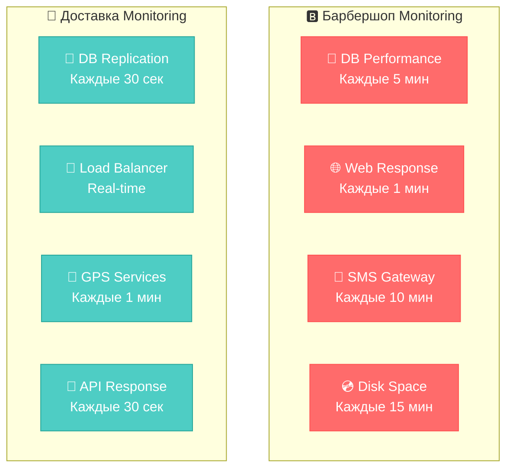

# 🛡️ Exercise 04 — Атрибуты доступности и надежности

<!--
Student: @https://edu.21-school.ru/profile/lunchlpr
Location: SKD SAMARKAND  
GitHub: https://github.com/wh0mever

-->

## 📝 Задание

**Указать атрибуты доступности и надежности для каждой задачи с конкретными SLA и стратегиями восстановления.**

## 🏗️ Архитектура отказоустойчивости

## 📊 Сравнительная таблица SLA

| Метрика | 🅱️ Барбершоп | 🚚 Доставка | Обоснование |
|---------|---------------|-------------|-------------|
| **📡 Доступность (рабочее время)** | 99.5% | 99.9% | B2C: гибкость vs B2B: критичность |
| **📡 Доступность (нерабочее время)** | 95% | 99.9% | Барбершоп: техобслуживание OK |
| **🛡️ MTTR (время восстановления)** | ≤ 30 мин | ≤ 10 мин | B2B требует быстрого восстановления |
| **💾 RPO (потеря данных)** | ≤ 15 мин | ≤ 5 мин | Доставка: финансовые последствия |
| **🔄 RTO (время до полного восстановления)** | ≤ 60 мин | ≤ 20 мин | Операционные требования |

## 🎯 Детальные атрибуты доступности

### 🅱️ Барбершоп - B2C Доступность

```mermaid
gantt
    title График доступности Барбершопа
    dateFormat  HH:mm
    axisFormat %H:%M
    
    section Понедельник-Пятница
    Работа системы (99.5%)    :active, 09:00, 21:00
    Техобслуживание          :crit, 02:00, 04:00
    
    section Выходные  
    Работа системы (99.5%)    :active, 10:00, 20:00
    Техобслуживание          :crit, 03:00, 05:00
```

#### 📈 SLA требования:
| Период | Доступность | Простой в месяц | Критичность |
|--------|-------------|-----------------|-------------|
| **Рабочие часы (9:00-21:00)** | 99.5% | ≤ 3.6 часов | 🔴 Критично |
| **Внерабочие часы** | 95% | ≤ 36 часов | 🟡 Умеренно |
| **Техобслуживание** | Запланированное 2-4 AM | 4 часа/неделя | 🟢 Приемлемо |

#### 🔧 Стратегии обеспечения доступности:
- **Мониторинг**: Каждые 5 минут
- **Автоматический перезапуск**: При критических ошибках  
- **Резервирование**: Еженедельные backup'ы
- **Уведомления**: SMS менеджерам при простое > 15 мин

### 🚚 Доставка - B2B Доступность

```mermaid
gantt
    title График доступности Доставки (24/7)
    dateFormat  HH:mm
    axisFormat %H:%M
    
    section 24/7 Работа
    Система доступна (99.9%)  :active, 00:00, 24:00
    Техобслуживание (окно)    :milestone, 04:00, 0
```

#### 📈 SLA требования:
| Период | Доступность | Простой в месяц | Критичность |
|--------|-------------|-----------------|-------------|
| **24/7 операции** | 99.9% | ≤ 43 минуты | 🔴 Критично |
| **Пиковые часы (11:30-14:30, 18:00-21:00)** | 99.95% | ≤ 22 минуты | 🔴 Критично |
| **Техобслуживание** | Rolling updates | 0 минут простоя | 🔴 Критично |

#### 🔧 Стратегии обеспечения доступности:
- **Мониторинг**: Real-time (каждые 30 сек)
- **Load Balancing**: Автоматическое переключение
- **Hot Standby**: Мгновенное переключение на резерв
- **Geographical redundancy**: Резерв в другом ЦОД

## 🛡️ Атрибуты надежности

### 🔄 Стратегии восстановления

```mermaid
graph TB
    subgraph "🅱️ Барбершоп: Восстановление"
        B_DETECT["🔍 Обнаружение<br/>≤ 5 мин"]
        B_NOTIFY["📱 Уведомление<br/>≤ 2 мин"]
        B_RESTORE["🔧 Восстановление<br/>≤ 30 мин"]
        B_VERIFY["✅ Проверка<br/>≤ 10 мин"]
        
        B_DETECT --> B_NOTIFY
        B_NOTIFY --> B_RESTORE
        B_RESTORE --> B_VERIFY
    end
    
    subgraph "🚚 Доставка: Восстановление"
        D_DETECT["🔍 Обнаружение<br/>≤ 1 мин"]
        D_AUTO["🤖 Автовосстановление<br/>≤ 2 мин"]
        D_MANUAL["👨‍💻 Ручное вмешательство<br/>≤ 10 мин"]
        D_VERIFY["✅ Проверка<br/>≤ 3 мин"]
        
        D_DETECT --> D_AUTO
        D_AUTO --> D_MANUAL
        D_MANUAL --> D_VERIFY
    end
    
    classDef barbershop fill:#ff6b6b,stroke:#ff5252,color:#fff
    classDef delivery fill:#4ecdc4,stroke:#26a69a,color:#fff
    
    class B_DETECT,B_NOTIFY,B_RESTORE,B_VERIFY barbershop
    class D_DETECT,D_AUTO,D_MANUAL,D_VERIFY delivery
```

### 📊 Детальные метрики надежности

#### 🅱️ Барбершоп
| Метрика | Целевое значение | Измерение | Действия при нарушении |
|---------|------------------|-----------|------------------------|
| **MTBF** (Среднее время между сбоями) | ≥ 720 часов (30 дней) | Автоматический мониторинг | Анализ причин, улучшение кода |
| **MTTR** (Время восстановления) | ≤ 30 минут | От обнаружения до восстановления | Оптимизация процедур |
| **MTTD** (Время обнаружения) | ≤ 5 минут | Система мониторинга | Улучшение алертов |
| **Успешность backup** | 100% | Еженедельная проверка | Уведомление администратора |

#### 🚚 Доставка  
| Метрика | Целевое значение | Измерение | Действия при нарушении |
|---------|------------------|-----------|------------------------|
| **MTBF** (Среднее время между сбоями) | ≥ 2160 часов (90 дней) | Автоматический мониторинг | Критический анализ |
| **MTTR** (Время восстановления) | ≤ 10 минут | Автоматизированное восстановление | Escalation к DevOps |
| **MTTD** (Время обнаружения) | ≤ 1 минута | Real-time мониторинг | Немедленный алерт |
| **Успешность синхронизации** | 99.99% | Continuous monitoring | Автоматическое восстановление |

## 💾 Стратегии резервного копирования

### 🅱️ Барбершоп - Backup стратегия

**Политика хранения:**
- **RPO**: ≤ 15 минут (потеря данных)
- **RTO**: ≤ 60 минут (полное восстановление)
- **Retention**: 90 дней оперативно, 3 года архив

### 🚚 Доставка - Backup стратегия

**Политика хранения:**
- **RPO**: ≤ 5 минут (критические данные)
- **RTO**: ≤ 20 минут (автоматическое переключение)
- **Retention**: Непрерывная репликация + архив 7 лет

## 🚨 Процедуры реагирования на инциденты

### 📋 Классификация инцидентов

### 🎯 Эскалационная матрица

| Инцидент | Барбершоп | Доставка | Участники |
|----------|-----------|----------|-----------|
| **P1 - Критический** | 15 мин → 30 мин → 1 час | 5 мин → 10 мин → 20 мин | Admin → DevOps → CTO |
| **P2 - Высокий** | 1 час → 4 часа → 1 день | 30 мин → 2 часа → 4 часа | Support → Lead Dev → PM |
| **P3 - Средний** | 4 часа → 1 день → 3 дня | 2 часа → 8 часов → 1 день | Dev Team → QA Lead |
| **P4 - Низкий** | 1 день → 1 неделя | 1 день → 3 дня | Dev Team |

## 📈 Мониторинг и алертинг

### 🔍 Ключевые метрики мониторинга

## 🏆 Сравнительный анализ стратегий

### 🎯 Ключевые различия подходов:

| Аспект | 🅱️ Барбершоп (B2C) | 🚚 Доставка (B2B) |
|--------|---------------------|-------------------|
| **Философия** | Доступность в рабочие часы | Непрерывная операционная готовность |
| **Простои** | Планируемые техокна приемлемы | Zero-downtime deployment |
| **Восстановление** | Ручное с уведомлениями | Автоматическое с мониторингом |
| **Инвестиции** | Умеренные в надежность | Высокие в отказоустойчивость |

### 💡 Стратегические выводы:

1. **B2C системы** могут позволить себе **запланированные простои** для экономии ресурсов
2. **B2B системы** требуют **максимальной надежности** из-за финансовых последствий простоев
3. **Автоматизация восстановления** критична для операционных систем
4. **Географическая избыточность** оправдана только для критически важных B2B сервисов

---

**📋 Оценка:** Шкала от 1 до 5 ⭐⭐⭐⭐⭐

**🔄 Следующий шаг:** [Exercise 05 - Масштабирование](exercise_05.md) 