# 📈 Exercise 05 — Атрибуты масштабирования

<!--
Student: @https://edu.21-school.ru/profile/lunchlpr
Location: SKD SAMARKAND  
GitHub: https://github.com/wh0mever

-->

## 📝 Задание

**Указать атрибуты масштабирования и локализации для обеих задач с конкретными планами роста.**

## 🗺️ Географическая стратегия масштабирования

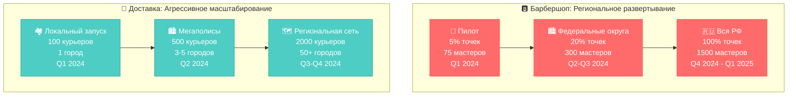

## 📊 Детальные планы масштабирования

### 🅱️ Барбершоп - Поэтапное масштабирование

#### 🚀 Фаза 1: Пилотный проект (Q1 2024)
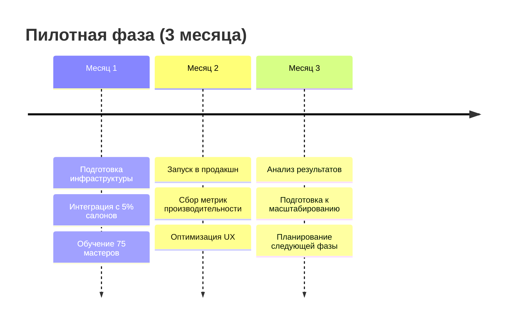

**Технические требования пилота:**
| Метрика | Целевое значение | Инфраструктура |
|---------|------------------|----------------|
| **Пользователей одновременно** | 200 | 1 сервер приложений |
| **Мастеров активных** | 75 | Основная БД + резерв |
| **Записей в день** | 500-800 | CDN + кэширование |
| **Время отклика** | ≤ 2 сек | Локальная инфраструктура |

#### 🏙️ Фаза 2: Региональное развертывание (Q2-Q3 2024)
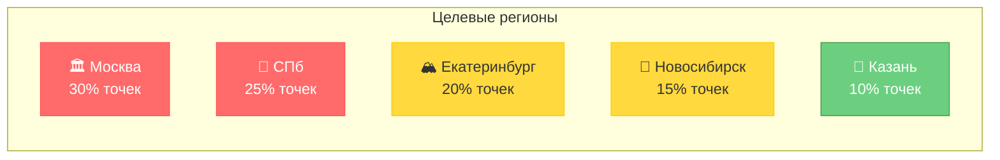

**Масштабирование инфраструктуры:**
- **Горизонтальное масштабирование**: 3 сервера приложений
- **Базы данных**: Master-Slave репликация
- **CDN**: Региональные точки присутствия
- **Мониторинг**: 24/7 техподдержка

#### 🇷🇺 Фаза 3: Федеральное покрытие (Q4 2024 - Q1 2025)
| Федеральный округ | Количество салонов | Мастеров | Особенности |
|-------------------|-------------------|----------|-------------|
| **Центральный** | 450 | 350 | Москва + области |
| **Северо-Западный** | 280 | 220 | СПб + регионы |
| **Уральский** | 180 | 140 | Промышленные центры |
| **Сибирский** | 220 | 170 | Крупные города |
| **Приволжский** | 200 | 160 | Казань, Нижний Новгород |
| **Южный** | 120 | 95 | Ростов, Краснодар |
| **Дальневосточный** | 100 | 80 | Владивосток, Хабаровск |

### 🚚 Доставка - Агрессивное масштабирование

#### 🏘️ Фаза 1: Локальный запуск (Q1 2024)
**MVP города:** Москва (выбранный район)
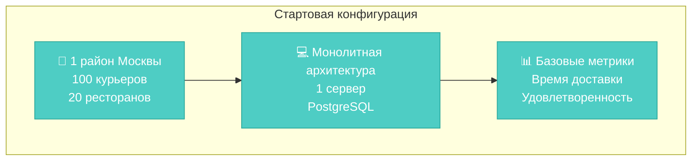

#### 🏙️ Фаза 2: Мегаполисы (Q2 2024)
**Целевые города:**
1. **Москва** - полное покрытие (300 курьеров)
2. **Санкт-Петербург** - центр + спальные районы (150 курьеров)
3. **Екатеринбург** - тестовый регион (50 курьеров)

**Архитектурные изменения:**
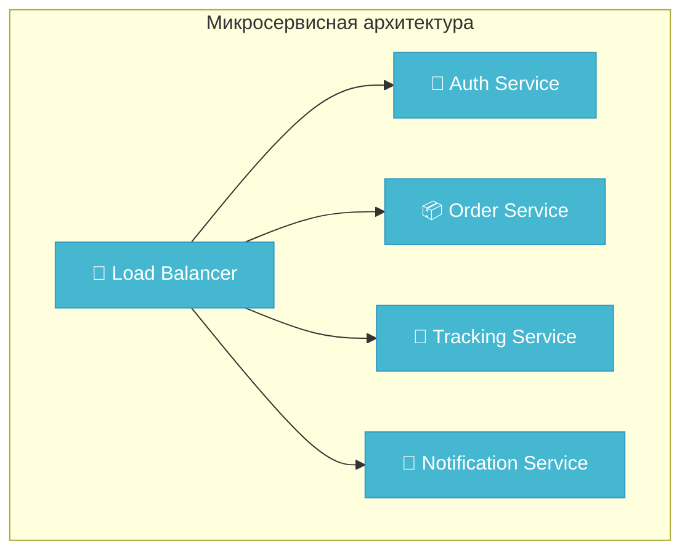

#### 🗺️ Фаза 3: Региональная сеть (Q3-Q4 2024)
**План покрытия по населению:**

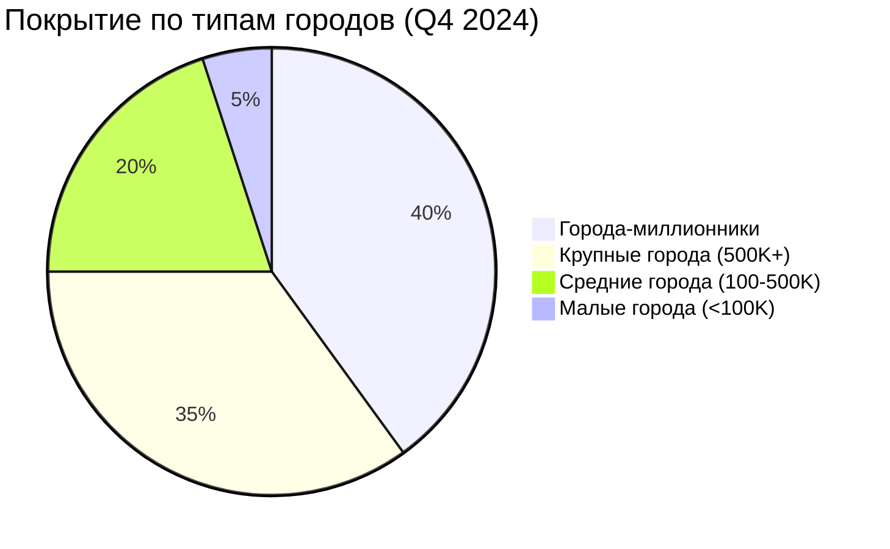

**Операционная модель:**
- **2000+ курьеров** по всей РФ
- **50+ городов** в 8 федеральных округах
- **Франчайзинговая модель** для средних городов
- **Партнерства** с местными службами доставки

## 🌍 Стратегии локализации

### 🅱️ Барбершоп - Региональная адаптация

#### 🕰️ Временные зоны
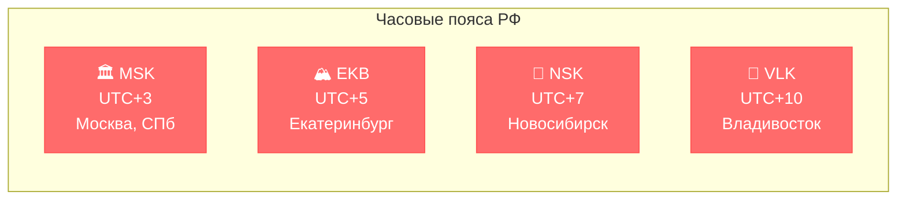

**Особенности локализации:**
- **Автоматическое определение** часового пояса пользователя
- **Локальное время** в уведомлениях и интерфейсе
- **Региональные праздники** в календаре мастеров
- **Местные традиции** (например, длинные выходные в Татарстане)

#### 💬 Языковая поддержка
| Регион | Основной язык | Дополнительно | Приоритет |
|--------|---------------|---------------|-----------|
| **Москва, СПб** | Русский | English | 🔴 Высокий |
| **Татарстан** | Русский | Татарский | 🟡 Средний |
| **Башкортостан** | Русский | Башкирский | 🟡 Средний |
| **Якутия** | Русский | Якутский | 🟢 Низкий |

#### 🎨 Культурная адаптация
- **Региональные промо-акции** (День города, местные праздники)
- **Локальные способы оплаты** (региональные банки)
- **Культурные особенности** сервиса (например, борода в Чечне)

### 🚚 Доставка - Операционная локализация

#### 🏪 Интеграция с местными поставщиками
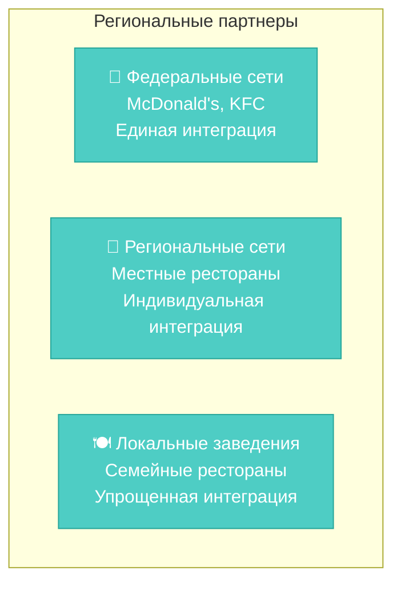

#### 📋 Региональное законодательство
| Аспект | Требования | Реализация |
|--------|------------|------------|
| **Трудовое право** | Региональные МРОТ | Автоматический расчет оплаты |
| **Налогообложение** | НДС, региональные льготы | Интеграция с 1С |
| **Лицензирование** | Местные разрешения | База данных лицензий |
| **СанПиН** | Требования к доставке еды | Сертификация курьеров |

#### 🛣️ Логистическая адаптация
- **Дорожная инфраструктура**: адаптация маршрутов под местные условия
- **Погодные условия**: алгоритмы для севера и юга
- **Транспортные ограничения**: учет местного трафика
- **Географические особенности**: острова, горы, удаленные районы

## 📊 Технические требования масштабирования

### 🏗️ Архитектурные решения

#### 🅱️ Барбершоп - Горизонтальное масштабирование
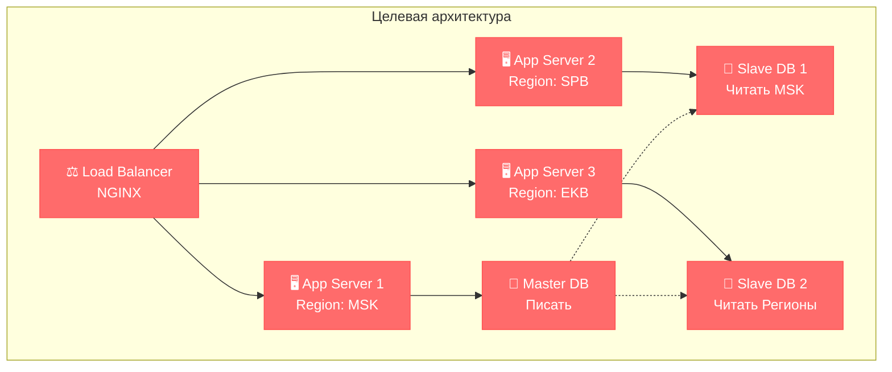

#### 🚚 Доставка - Микросервисы + Kubernetes
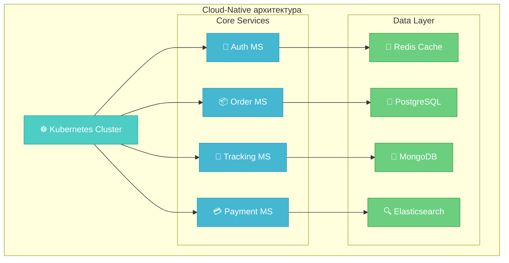

## 📈 Планирование ресурсов

### 💰 Бюджетное планирование

#### 🅱️ Барбершоп - Инвестиции по фазам
| Фаза | Инфраструктура | Разработка | Маркетинг | Общий бюджет |
|------|----------------|------------|-----------|--------------|
| **Пилот (Q1)** | 500K ₽ | 2M ₽ | 1M ₽ | **3.5M ₽** |
| **Регионы (Q2-Q3)** | 2M ₽ | 3M ₽ | 5M ₽ | **10M ₽** |
| **Федерация (Q4-Q1)** | 5M ₽ | 4M ₽ | 15M ₽ | **24M ₽** |

#### 🚚 Доставка - Агрессивные инвестиции
| Фаза | Инфраструктура | Разработка | Операции | Общий бюджет |
|------|----------------|------------|----------|--------------|
| **MVP (Q1)** | 1M ₽ | 3M ₽ | 2M ₽ | **6M ₽** |
| **Мегаполисы (Q2)** | 5M ₽ | 5M ₽ | 10M ₽ | **20M ₽** |
| **Регионы (Q3-Q4)** | 15M ₽ | 8M ₽ | 30M ₽ | **53M ₽** |

## 🎯 Критерии успеха масштабирования

### 📊 KPI мониторинг

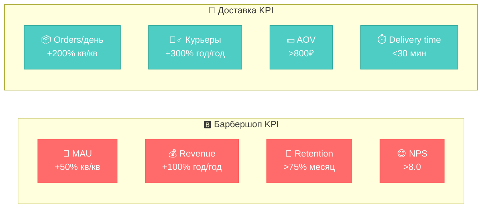

## 🏆 Стратегические выводы

### ✅ Ключевые принципы масштабирования:

1. **Барбершоп**: **Постепенное масштабирование** с фокусом на качество сервиса
2. **Доставка**: **Агрессивный рост** для захвата рынка
3. **Локализация**: Критична для **регионального успеха**
4. **Техническая готовность**: Архитектура должна **опережать** бизнес-потребности

### 🎨 Риски и митигация:

| Риск | Барбершоп | Доставка | Митигация |
|------|-----------|----------|-----------|
| **Технические проблемы** | 🟡 Средний | 🔴 Высокий | Поэтапное тестирование |
| **Региональные особенности** | 🔴 Высокий | 🟡 Средний | Локальные партнеры |
| **Конкуренция** | 🟢 Низкий | 🔴 Высокий | Уникальное позиционирование |
| **Инвестиции** | 🟡 Средний | 🔴 Высокий | Поэтапное финансирование |

---

**📋 Оценка:** Шкала от 1 до 5 ⭐⭐⭐⭐⭐

**🔄 Следующий шаг:** [Exercise 06 - Безопасность](exercise_06.md) 