# 🔒 Exercise 06 — Атрибуты безопасности

<!--
Student: @https://edu.21-school.ru/profile/lunchlpr
Location: SKD SAMARKAND  
GitHub: https://github.com/wh0mever

-->

## 📝 Задание

**Описать требования к безопасности в части паролей и логирования с различными подходами для каждой задачи.**

## 🏗️ Архитектура безопасности

```mermaid
graph TB
    subgraph "🅱️ Барбершоп: Потребительская безопасность"
        B_AUTH["🔐 Простая аутентификация<br/>Email + Password"]
        B_2FA["📱 SMS 2FA<br/>Для критических операций"]
        B_SESSION["🍪 Session Management<br/>30 дней"]
        B_ENCRYPT["🔒 Base Encryption<br/>HTTPS + BCrypt"]
        
        B_AUTH --> B_2FA
        B_2FA --> B_SESSION
        B_SESSION --> B_ENCRYPT
    end
    
    subgraph "🚚 Доставка: Корпоративная безопасность"
        D_AUTH["🔐 Усиленная аутентификация<br/>Login + Password + Pin"]
        D_MFA["🛡️ Multi-Factor Auth<br/>App + Биометрия"]
        D_RBAC["👥 Role-Based Access<br/>Строгая сегментация"]
        D_ENCRYPT["🔒 Enterprise Encryption<br/>End-to-end + AES-256"]
        
        D_AUTH --> D_MFA
        D_MFA --> D_RBAC
        D_RBAC --> D_ENCRYPT
    end
    
    classDef barbershop fill:#ff6b6b,stroke:#ff5252,color:#fff
    classDef delivery fill:#4ecdc4,stroke:#26a69a,color:#fff
    
    class B_AUTH,B_2FA,B_SESSION,B_ENCRYPT barbershop
    class D_AUTH,D_MFA,D_RBAC,D_ENCRYPT delivery
```

## 🔑 Требования к паролям

### 🅱️ Барбершоп - Потребительский подход

#### 📋 Состав пароля
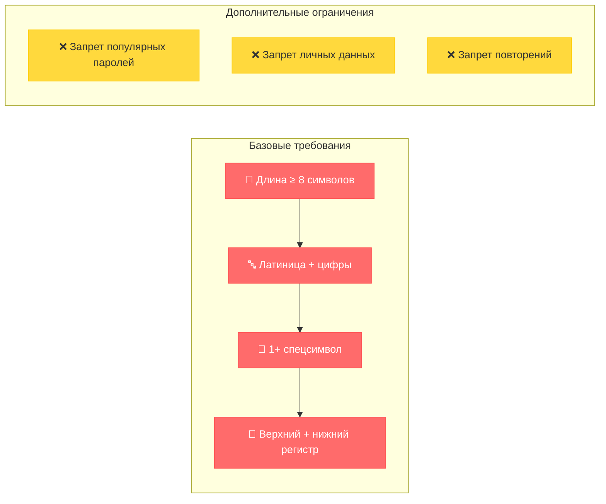

**Детальные требования:**
| Критерий | Требование | Пример валидного | Пример невалидного |
|----------|------------|------------------|-------------------|
| **Минимальная длина** | 8+ символов | `MyPass123!` | `Pass123` |
| **Латинские буквы** | Обязательно | `Password1!` | `Пароль123!` |
| **Цифры** | Минимум 1 | `Password1!` | `Password!` |
| **Спецсимволы** | Минимум 1 из: `!@#$%^&*()` | `Password1!` | `Password123` |
| **Регистр** | Верхний + нижний | `Password1!` | `password1!` |

#### 🔄 Правила сброса и смены пароля

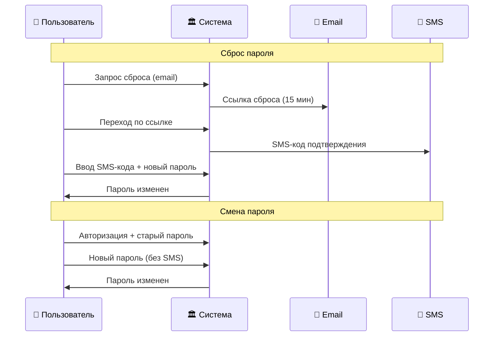

**Политика смены:**
- **Принудительная смена**: Не требуется (потребительский сервис)
- **Повторное использование**: Запрет последних 3 паролей
- **Время жизни ссылки сброса**: 15 минут
- **Блокировка после неудачных попыток**: 5 попыток → блокировка на 30 минут

### 🚚 Доставка - Корпоративный подход

#### 📋 Усиленный состав пароля
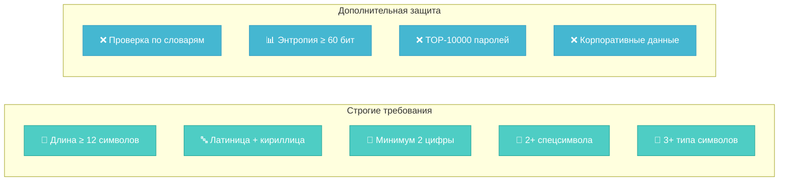

**Детальные требования:**
| Критерий | Требование | Пример валидного | Пример невалидного |
|----------|------------|------------------|-------------------|
| **Минимальная длина** | 12+ символов | `MySecure123!@#Pass` | `SecPass1!` |
| **Языки** | Латиница ИЛИ кириллица | `MyPassword123!` | `МойPassword123!` |
| **Цифры** | Минимум 2 | `Password12!` | `Password1!` |
| **Спецсимволы** | Минимум 2 | `Password12!@` | `Password12!` |
| **Сложность** | 3+ типа символов | `Pass12!` | `password123` |

#### 🔄 Корпоративные правила сброса

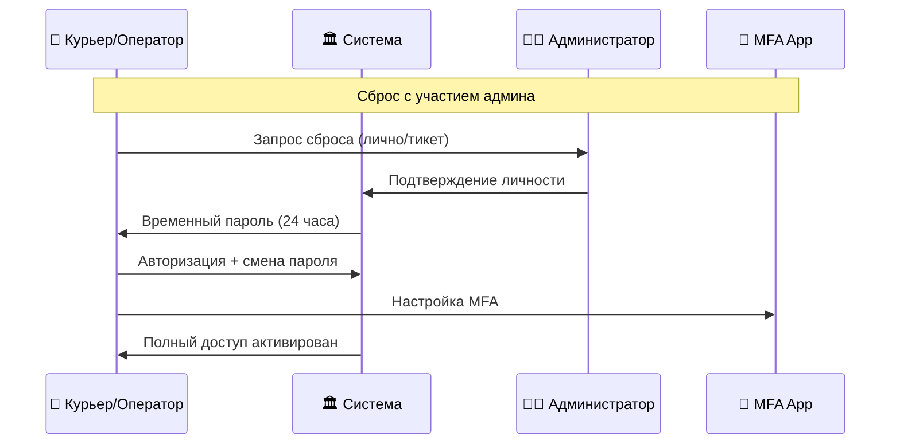

**Политика смены:**
- **Принудительная смена**: Каждые 90 дней
- **Повторное использование**: Запрет последних 12 паролей
- **Время жизни**: Временный пароль действует 24 часа
- **Блокировка**: 3 попытки → блокировка на 60 минут → уведомление админа

## 🛡️ Многофакторная аутентификация (MFA)

### 🅱️ Барбершоп - Селективная 2FA

#### 📱 Действия, требующие 2FA
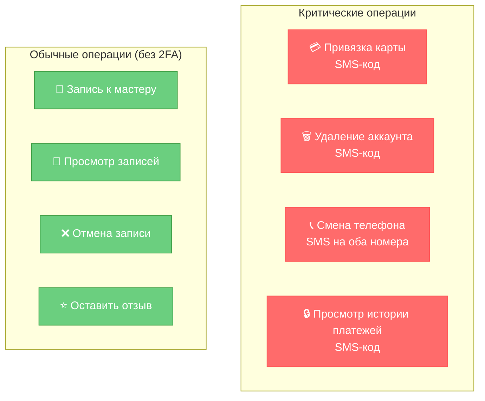

#### 🔐 Порядок аутентификации для клиентов
1. **Основная авторизация**: Email + пароль
2. **Триггер 2FA**: При выполнении критической операции
3. **SMS-код**: Отправка на зарегистрированный номер
4. **Время действия кода**: 5 минут
5. **Повторная отправка**: Через 60 секунд
6. **Блокировка**: После 3 неверных попыток на 15 минут

### 🚚 Доставка - Обязательная MFA

#### 📱 Многоуровневая аутентификация
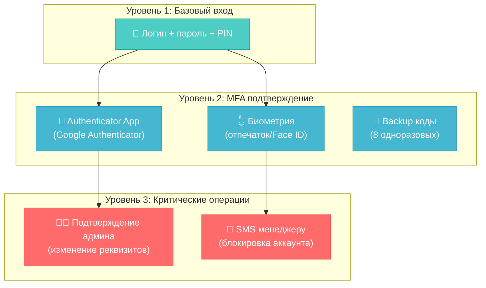

#### 🎯 Действия по ролям
| Роль | Требуемые факторы | Критические операции |
|------|-------------------|---------------------|
| **👤 Курьер** | Пароль + Биометрия | Принятие заказа, изменение статуса |
| **📞 Оператор** | Пароль + Authenticator | Создание заказа, отмена заказа |
| **👨‍💼 Диспетчер** | Пароль + Authenticator + SMS | Переназначение заказов, блокировка курьеров |
| **👨‍💻 Администратор** | Пароль + Authenticator + Approval | Управление ролями, финансовые операции |

#### 🔐 Корпоративный порядок аутентификации
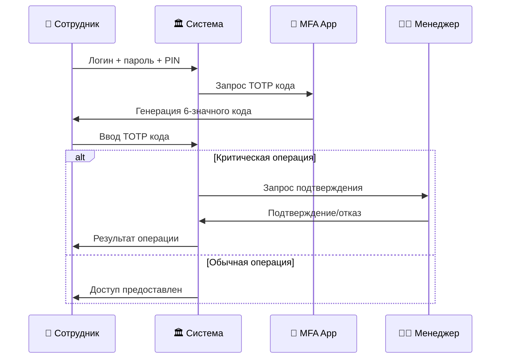

## 📋 Требования к логированию

### 🅱️ Барбершоп - Базовое логирование

#### 📊 Операции, требующие логирования
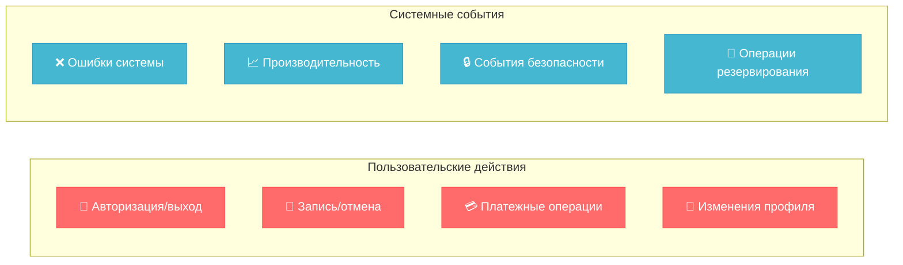

#### 📝 Логируемые данные для клиентов
| Категория | Данные | Формат | Хранение |
|-----------|--------|--------|----------|
| **🔐 Авторизация** | User ID, IP, время, результат | JSON | 90 дней |
| **📅 Записи** | User ID, мастер, время, статус | JSON | 3 года |
| **💳 Платежи** | User ID, сумма, метод, статус | Encrypted JSON | 7 лет |
| **👤 Профиль** | User ID, измененные поля, старые значения | JSON | 1 год |
| **❌ Ошибки** | User ID, endpoint, error code, stack trace | JSON | 30 дней |

#### 🔍 Пример лог-записи (Барбершоп)
```json
{
  "timestamp": "2024-01-15T14:30:00.000Z",
  "level": "INFO",
  "event": "user_booking_created",
  "user_id": "usr_12345",
  "ip_address": "192.168.1.100",
  "user_agent": "Mozilla/5.0...",
  "data": {
    "booking_id": "bk_67890",
    "master_id": "mst_456",
    "service": "haircut",
    "scheduled_time": "2024-01-20T10:00:00.000Z",
    "salon_id": "salon_789"
  },
  "session_id": "sess_abc123"
}
```

### 🚚 Доставка - Корпоративное логирование

#### 📊 Расширенные операции логирования
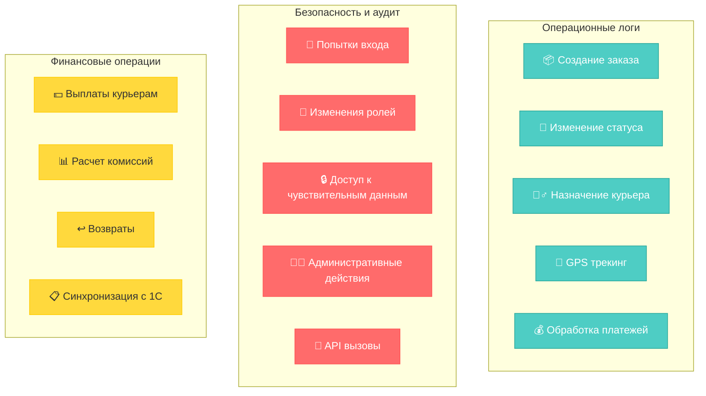

#### 📝 Детальные логируемые данные
| Категория | Данные | Уровень детализации | Хранение |
|-----------|--------|-------------------|----------|
| **📦 Заказы** | Полный lifecycle заказа | Каждое изменение | 7 лет |
| **🚴‍♂️ Курьеры** | GPS, статусы, платежи | Real-time трекинг | 3 года |
| **💰 Финансы** | Все транзакции + комиссии | Полная детализация | 10 лет |
| **🔐 Безопасность** | Все события доступа | Максимальная детализация | 5 лет |
| **📊 Аналитика** | Агрегированные метрики | Ежечасные/ежедневные | 2 года |

#### 🔍 Пример лог-записи (Доставка)
```json
{
  "timestamp": "2024-01-15T14:30:00.000Z",
  "level": "INFO",
  "event": "order_status_changed",
  "user_id": "courier_789",
  "role": "courier",
  "ip_address": "10.0.1.50",
  "location": {
    "lat": 55.7558,
    "lng": 37.6176,
    "accuracy": 5
  },
  "data": {
    "order_id": "ord_12345",
    "old_status": "assigned",
    "new_status": "picked_up",
    "restaurant_id": "rest_456",
    "estimated_delivery": "2024-01-15T15:00:00.000Z"
  },
  "session_id": "courier_sess_xyz789",
  "device_id": "device_courier_001",
  "app_version": "2.1.0"
}
```

## 🔐 Дополнительные меры безопасности

### 🅱️ Барбершоп - Потребительская защита
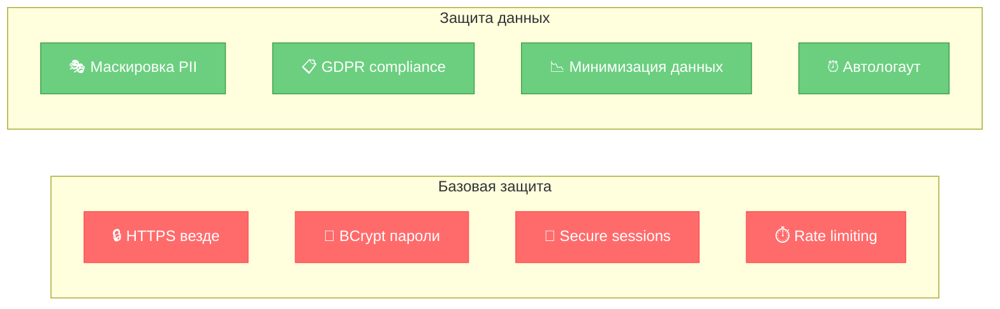

### 🚚 Доставка - Корпоративная защита
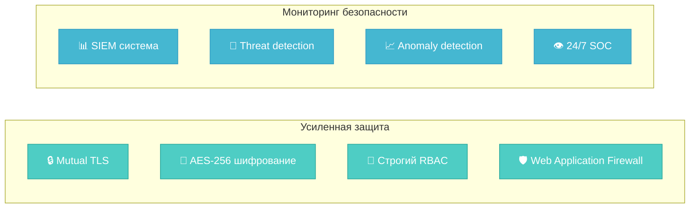

## 📊 Сравнительная таблица безопасности

| Аспект | 🅱️ Барбершоп (B2C) | 🚚 Доставка (B2B) |
|--------|---------------------|-------------------|
| **🔑 Пароли** | 8+ символов, базовая сложность | 12+ символов, высокая сложность |
| **🛡️ MFA** | SMS для критических операций | Обязательно для всех |
| **📋 Логирование** | Основные события, 90 дней | Полное логирование, 7+ лет |
| **🔒 Шифрование** | HTTPS + BCrypt | End-to-end + AES-256 |
| **👥 Доступ** | Простая авторизация | Role-based + принцип минимальных привилегий |
| **📊 Мониторинг** | Базовый | 24/7 SOC + SIEM |

## 🏆 Стратегические выводы

### ✅ Ключевые принципы:

1. **B2C (Барбершоп)**: **Баланс безопасности и удобства** - не отпугнуть клиентов
2. **B2B (Доставка)**: **Максимальная защита** - финансовые операции требуют строгости
3. **Логирование**: **Соответствие требованиям** - B2C минимум, B2B максимум
4. **MFA**: **Селективное vs обязательное** - разные подходы к внедрению

### 🎯 Практические рекомендации:

- **Барбершоп**: Постепенное внедрение 2FA, акцент на образование пользователей
- **Доставка**: Немедленное внедрение всех мер, обучение персонала обязательно
- **Обе системы**: Регулярные security аудиты и проникновения тесты

---

**📋 Оценка:** Шкала от 1 до 5 ⭐⭐⭐⭐⭐

**🎉 Проект завершен!** [Вернуться к обзору проекта](README.md) 